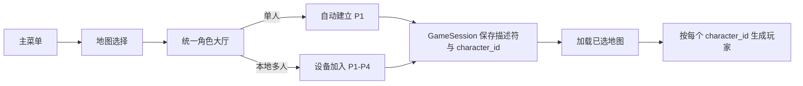

# 单人及本地多人统一选角设计

**日期：** 2026-08-13

**状态：** 已确认，待实施

**范围：** 单人选角、本地多人各座位独立并发选角、角色预览、会话传递与出生一致性

## 背景

项目的角色目录已包含男女各五种兵种，共十个稳定 `character_id`。联机大厅已经能让本机玩家
在目录中循环选角，并把选择经服务端 seat、`start.slots[]`、`GameSession` 传给实际玩家生成。
但另外两种游戏模式仍不完整：

- 单人从地图选择直接进入战斗，`LocalPlayerSpawner` 依靠隐式默认角色生成 P1。
- 本地多人虽已有四个 3D 站位和每座位的 `LocalPlayerDescriptor.character_id` 字段，界面却只做
  设备加入；开始前统一把所有空角色 ID 填成默认值，没有选角操作。

目标是让三种模式都能明确选择角色，同时保持既有的地图选择顺序、设备级输入隔离和数据驱动
角色目录。本文只改造单人和本地多人；联机选择规则不变。

## 已确认的产品决策

### 页面布局方案

比较过三种方案：

1. **加入即选角（采用）**：扩展现有四站位 3D 大厅，玩家加入后立即在自己的站位选角；单人只
   启用 P1。
2. 两阶段流程：先完成设备加入，再让各玩家依次进入大预览选角；角色更大，但多人必须等待。
3. 十角色矩阵：所有角色同时展示、四个玩家移动彩色光标；总览强，但四光标与双键盘提示拥挤。

采用方案 1，因为它复用已有大厅、`LobbyPlayerPreview` 和目录的前后循环接口，并允许多位玩家
真正同时选角。

### 选择规则

- 允许多个座位选择相同角色。
- 不维护角色占用表，不跳过已被其他座位选择的目录条目，也不显示冲突提示。
- 新建立的座位默认选择目录 `default_id()`，当前为 `male_assault`。
- 角色选择在目录首尾循环。

## 场景流程

单人与本地多人统一保持“先选地图、再选角色”的顺序：



`MapSelection` 不再让单人确认地图后直接调用 `configure_single()` 并进入地图。单人和本地多人
都进入 `LocalMultiplayerLobby.tscn`；场景根据 `GameSession.map_selection_mode` 决定运行模式。

### 单人状态

- 进入大厅时自动建立一个 P1 描述符，不要求按键加入。
- 隐藏 P2-P4 的站位预览、空位状态和等待加入信息。
- 标题显示“选择角色”。
- 确认后把包含最终 `character_id` 的 P1 描述符写入 `GameSession`，再加载已选地图。
- 返回地图选择后再次进入时重新建立 P1，并恢复目录默认角色，不保留上一轮临时选择。

单人仍使用现有组合输入源进入战斗。P1 描述符只负责携带玩家选择；
`LocalPlayerSpawner` 在 `SINGLE` 模式下继续使用传入的共享/组合输入实例，不调用该描述符的
独占设备输入工厂。

### 本地多人状态

- 仍由 WASD、方向键或未分配手柄加入最前面的空座位，最多四人。
- 新玩家加入时立即写入默认 `character_id` 并刷新该站位预览。
- 每位已加入且在线的玩家能独立切换自己的角色。
- 标题显示“本地多人 · 加入并选择角色”。
- P1 负责开始；任一已有座位设备离线时保持当前规则，禁止开始。
- 离线座位保留角色 ID 和预览，设备恢复后继续从原选择操作。
- 返回地图选择后再次进入时重新建立座位，不保留上一轮加入名单或角色选择。

## 输入设计

大厅按物理事件来源查找座位，不使用全局选角焦点。一个事件只允许修改与其来源匹配的座位。

### 本地多人

| 玩家输入来源 | 上一个角色 | 下一个角色 | 加入 | P1 开始 | 返回 |
|---|---|---|---|---|---|
| 键盘 WASD | `A` | `D` | 任一 `W/A/S/D` | `Enter` | `Esc` |
| 键盘方向键 | `←` | `→` | 任一方向键 | `Enter` | `Esc` |
| 手柄 N | `LB` | `RB` | 未分配时 `A` | P1 对应手柄 `Start` | P1 对应手柄 `B` |

- 键盘 `InputEventKey.echo` 不触发加入、选角或开始，每次真实按下最多移动一个目录位置。
- 手柄事件必须按 `device` 匹配对应 `LocalPlayerDescriptor.gamepad_device_id`。
- 已加入手柄的 `A` 不执行开始，也不重复加入。
- 多个设备在同一渲染帧产生事件时，各事件依次修改自己的描述符；没有跨座位锁，最终状态互不
  覆盖。
- 只有 P1 当前的输入来源拥有开始与手柄返回权限。`Esc` 是全局键盘返回键。

现有“按 A 加入”和 WASD/方向键加入行为与选角键有重叠。处理顺序固定为：先检查该来源是否
已经占座；未占座则执行加入并结束该事件，已占座才按该来源的选角映射处理。因此用于加入的
第一次 `A`、`D` 或方向键不会在同一事件内顺便切换新玩家的默认角色。

### 单人

- `A/D`、`←/→`、任意已连接手柄的 `LB/RB` 均可切换 P1。
- `Enter`、任意手柄的 `A` 或 `Start` 确认并开始。
- `Esc` 或任意手柄的 `B` 返回地图选择。
- 单人没有设备占座，所以手柄 `A` 只表示确认。

## 组件与数据边界

### `LocalMultiplayerLobby`

继续作为统一角色大厅的场景控制器，新增明确的单人/本地多人模式分支，职责为：

1. 根据 `GameSession.map_selection_mode` 建立初始座位状态。
2. 把物理输入事件路由到对应座位。
3. 通过 `CharacterCatalog.next_id()` 更新描述符的 `character_id`。
4. 让对应 `LobbyPlayerPreview` 与文字状态读取同一个描述符并刷新。
5. 在 P1 请求开始时校验全部状态，将描述符写入 `GameSession` 后加载地图。

选角规则应提取为可直接验证的小函数或状态对象，避免把目录循环、设备匹配、单人分支全部堆在
`_input()` 内。场景控制器保留节点操作与场景切换职责。

### `LocalPlayerDescriptor`

每个座位只保留一份权威选择：

```gdscript
var character_id: StringName
```

预览不保存另一份选中下标。切换时先更新描述符，再从目录按 ID 解析定义。允许重复意味着不同
描述符可以持有相同 ID。

### `LobbyPlayerPreview`

复用现有 `set_character_definition()`：释放旧模型、实例化新定义的 `model_scene`、播放循环
`Idle_Gun`。同时通过 `set_accent_color()` 更新名牌描边和站位灯。大厅状态文字显示：

- `P1-P4`
- 输入来源
- `CharacterDefinition.display_name`
- 对应该来源的前后切换提示
- 离线状态（如有）

空座位不实例化角色模型，继续显示“等待加入”。单人模式只让 P1 可见。

### `GameSession` 与 `LocalPlayerSpawner`

- `configure_single()` 接收或读取一个带 `character_id` 的 P1 描述符，并让
  `local_players` 保存该描述符，而不是清空列表后依赖默认角色。
- `configure_local(players)` 继续复制座位描述符列表。
- `LocalPlayerSpawner` 对单人、本地多人和联机三种模式统一从描述符读取 `character_id`；只有
  输入源创建仍按模式分叉。
- 解析出的 `CharacterDefinition` 继续由 `PlayerController.apply_character_definition()` 应用
  模型、生命/速度/伤害系数、被动和强调色，并在生成后装备本命武器。

大厅预览与实际出生消费同一个 `character_id`，从数据边界上防止“预览切了角色，但进入游戏
仍是默认角色”。

## 无效内容与错误处理

- 目录为空、`default_id()` 为空或 ID 无法解析时，不允许进入战斗。
- 开始前逐个验证已加入描述符的 ID；错误信息显示在大厅底部状态区域，并保留当前大厅供玩家
  返回，不静默替换成其他角色。
- 单人必须恰好有一个有效 P1 描述符；本地多人必须有 1-4 个有效且在线的描述符。
- 模型资源缺失时由现有预览告警和角色模型校验报告；开始闸门仍以 definition 是否存在为最低
  内容条件，导入完整性由构建校验拦截。

## UI 设计

沿用现有 3D 大厅、四个世界站位、警戒灯和 CanvasLayer 文本，不新建角色矩阵或弹层。

- 所有关键 2D 文本继续使用 `assets/fonts/NotoSansSC-UI.ttf`。
- 标题、提示和状态条使用锚点/容器，保持已有横屏响应式布局。
- 角色强调色同步到 `LobbyPlayerPreview.PlayerLight`、`PlayerLabel.outline_modulate` 和座位状态
  文字；离线变暗仍与强调色分离。
- 本地多人同时显示最多四个角色；单人只显示 P1，并隐藏其余站位而不是保留三个空框。
- 不引入鼠标专用流程。键盘和手柄操作提示直接出现在对应座位状态文字中。

## 验证策略

按项目规范使用源码级/headless 校验，不使用 CUA 自动点击游戏界面。

### 新增或扩展的行为校验

1. 单人进入大厅会自动建立一个默认角色 P1，P2-P4 不可见。
2. 单人通过键盘或手柄循环十个角色，首尾相接，确认后 `GameSession` 保存所选 ID。
3. 本地玩家加入后立即获得默认 ID；用于加入的事件不会在同一帧额外切换角色。
4. WASD、方向键和各手柄事件只能改变各自座位。
5. 两个座位可持有同一个 ID，且同帧切换不会互相覆盖。
6. 键盘 echo 不切换；错误设备的手柄事件不修改其他座位。
7. 只有 P1 来源能开始；已有座位离线时不能开始。
8. 返回地图选择并再次进入会重建选择状态。
9. `LobbyPlayerPreview` 的模型、显示名和强调色随 definition 更新。
10. 单人和本地多人实际生成的每名玩家 definition 与大厅描述符一致。
11. 无效或未知 ID 禁止开始并产生明确错误。

### 回归校验

- `validate_character_catalog.gd`
- `validate_generated_character_models.gd`
- `validate_lobby_player_preview.gd`
- `validate_character_model_switching.gd`
- `validate_character_stats_apply.gd`
- `validate_content_session_routing.gd`
- 新增 `validate_single_local_character_selection.gd`，集中覆盖统一大厅的模式、输入与会话行为
- `validate_ui_font_coverage.gd`
- Godot headless editor import/parse 检查
- `git diff --check`

### 人工视觉验收

源码级校验通过后，请用户在游戏中完成以下检查并提供截图：

1. 单人角色大厅只出现 P1，角色完整入镜，名称与操作提示不重叠。
2. 本地四人全部加入，四个不同体型角色都位于各自站位，状态文字在目标横屏分辨率内可读。
3. 切换角色后模型、名称、灯光色同时变化，无旧模型残留。
4. 设备离线时角色变暗但原强调色仍可辨认。

角色模型自身仍需单独完成既有的分件贴合视觉 QA；本设计不把“能选择”误当作模型美术已验收。

## 范围外

- 不改变联机大厅与服务端角色选择协议。
- 不禁止重复角色，不新增角色抢占或准备锁定规则。
- 不支持战斗中换角色或热加入。
- 不持久化上一次选角到存档。
- 不新增角色详情页、属性对比面板或角色矩阵。
- 不新增按键重映射。
- 不解决生成角色模型现存的悬浮分件美术问题；该问题继续走独立 Blender MCP 修模与视觉验收。
